# MXK8 虚拟卡管理 - 页面原型图

本文档基于 [PRD.md](PRD.md) §4 为每个页面提供布局说明、结构级线框（Mermaid）与元素清单，便于产品与开发对齐界面结构。实现页面时请先对齐本原型再写代码。

**HTML 设计图**：可在浏览器中查看的线框设计图位于 [docs/design/](design/) 目录，[design/index.html](design/index.html) 为索引页，每页对应一个 HTML 文件（如 `01-login.html`～`11-funds-list.html`）。

---

## 1. 登录页

- **路由**：`pages/auth/login`
- **文件**：`src/pages/auth/login.vue`

### 布局说明

全屏居中表单：无 TabBar；顶部可为导航栏或 Logo 区；主体为登录表单（账号、密码、图形验证码、登录按钮）；适配安全区。

### 结构图

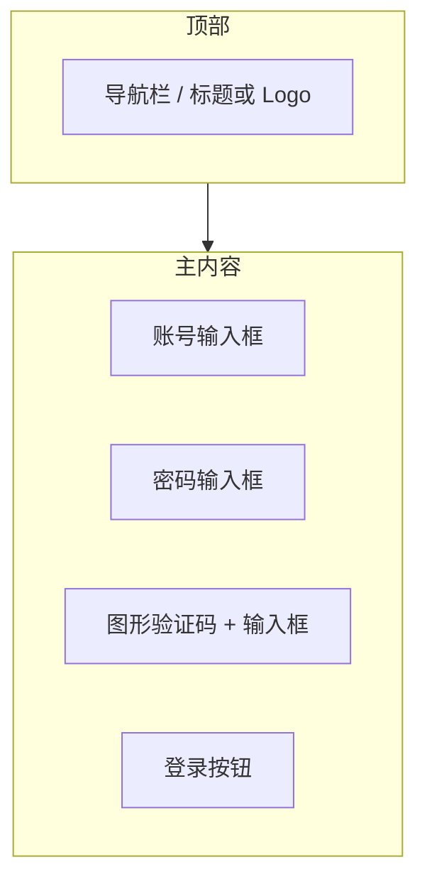

### 元素清单

| 区域 | 元素 | 说明（对应 PRD） |
|------|------|------------------|
| 顶部 | 导航栏/标题 | 可选：应用名或「登录」 |
| 表单 | 账号输入框 | 对应 username |
| 表单 | 密码输入框 | 对应 password，建议密文 |
| 表单 | 图形验证码 | 验证码图片 + 输入框，需校验 |
| 表单 | 登录按钮 | 提交后获取 access_token，跳转首页 |
| - | 退出时 | 清除本地 token 与用户信息（PRD §4.2） |

---

## 2. 首页

- **路由**：`pages/index/index`
- **文件**：`src/pages/index/index.vue`

### 布局说明

顶部导航；主内容自上而下：余额区（可用余额、卡片总余额，支持显隐）、收支统计（7/30/90 天 Tab + 收入/支出）、快捷入口（4 宫格）、最近交易（5 条列表）；底部 TabBar（首页 | 卡片 | 我的）。

### 结构图

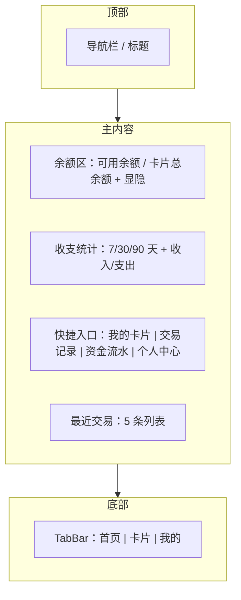

### 元素清单

| 区域 | 元素 | 说明（对应 PRD） |
|------|------|------------------|
| 顶部 | 导航栏 | 标题如「首页」 |
| 余额区 | 可用余额 | 支持金额隐藏/显示 |
| 余额区 | 卡片总余额 | 支持金额隐藏/显示 |
| 收支统计 | 周期切换 | 近 7 天、30 天、90 天 |
| 收支统计 | 收入金额 | mxk_pay_money_in |
| 收支统计 | 支出金额 | mxk_pay_money_out |
| 快捷入口 | 我的卡片 | 跳转 cards/list |
| 快捷入口 | 交易记录 | 跳转 bills/list |
| 快捷入口 | 资金流水 | 跳转 funds/list |
| 快捷入口 | 个人中心 | 跳转 profile/index |
| 最近交易 | 列表项 | 交易类型、金额、时间、状态，最多 5 条 |
| 底部 | TabBar | 首页、卡片、我的 |

---

## 3. 个人中心

- **路由**：`pages/profile/index`
- **文件**：`src/pages/profile/index.vue`

### 布局说明

顶部导航；主体为个人信息卡片（头像、昵称、ID）+ 菜单列表（修改密码、设置二级密码等）；无底部 TabBar 时需从首页/其他 Tab 进入，或有 TabBar「我的」高亮。

### 结构图

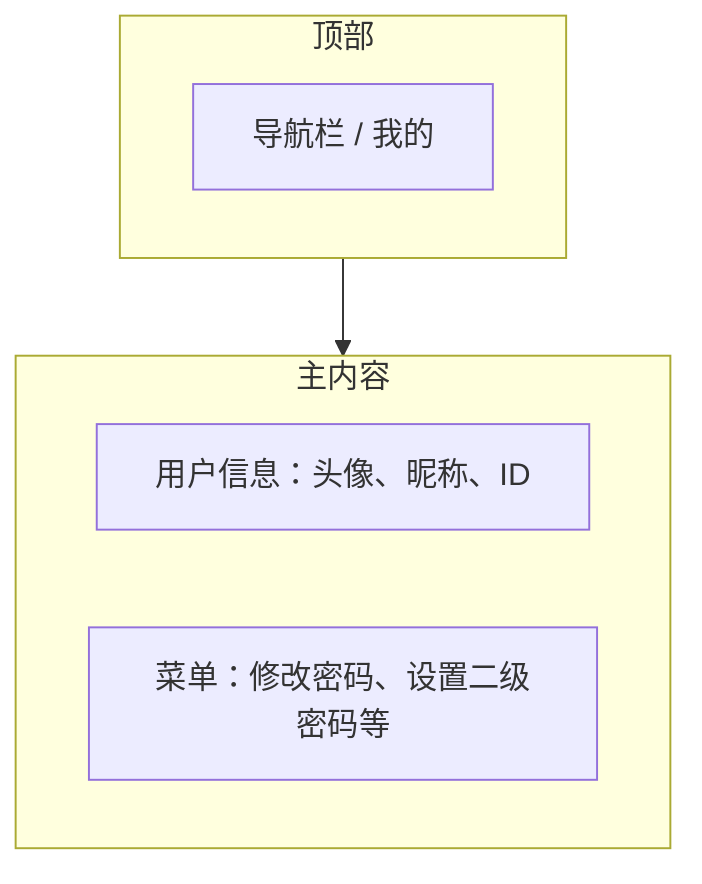

### 元素清单

| 区域 | 元素 | 说明（对应 PRD） |
|------|------|------------------|
| 顶部 | 导航栏 | 标题「个人中心」或「我的」 |
| 用户区 | 头像 | avatar |
| 用户区 | 昵称 | username |
| 用户区 | 用户 ID | id |
| 菜单 | 修改密码 | 跳转 profile/password |
| 菜单 | 设置二级密码 | 跳转 profile/second-password，用于查看完整卡号等敏感操作 |

---

## 4. 修改密码

- **路由**：`pages/profile/password`
- **文件**：`src/pages/profile/password.vue`

### 布局说明

顶部导航带返回；主体为表单：当前密码、新密码、确认新密码（可选）、提交按钮；需校验当前密码正确性（PRD §4.2）。

### 结构图

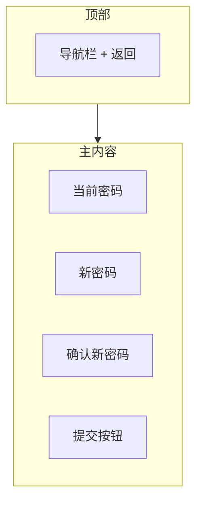

### 元素清单

| 区域 | 元素 | 说明（对应 PRD） |
|------|------|------------------|
| 顶部 | 导航栏 | 标题「修改密码」，返回个人中心 |
| 表单 | 当前密码 | currentPassword，必填 |
| 表单 | 新密码 | password，必填 |
| 表单 | 确认新密码 | 可选，前后端校验一致 |
| 表单 | 提交 | 调用 changPassword，需校验当前密码 |

---

## 5. 设置二级密码

- **路由**：`pages/profile/second-password`
- **文件**：`src/pages/profile/second-password.vue`

### 布局说明

顶部导航带返回；主体为表单：二级密码输入、确认输入、提交按钮；用于查看完整卡号等敏感操作（PRD §4.2）。

### 结构图

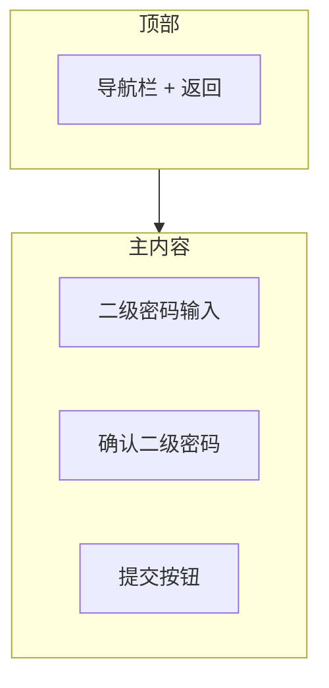

### 元素清单

| 区域 | 元素 | 说明（对应 PRD） |
|------|------|------------------|
| 顶部 | 导航栏 | 标题「设置二级密码」，返回个人中心 |
| 表单 | 二级密码 | secondPassword |
| 表单 | 确认二级密码 | 二次输入校验 |
| 表单 | 提交 | 调用 setSecondPassword |

---

## 6. 卡片列表

- **路由**：`pages/cards/list`
- **文件**：`src/pages/cards/list.vue`

### 布局说明

顶部导航，可带「创建卡片」入口；主内容为卡片列表（每项：卡号掩码、类型、可用额度/总额度、状态、操作：激活/禁用、充值、查看详情）；支持下拉刷新、分页；卡片充值可为弹窗/抽屉，内含快捷金额 50/100/200/500 及自定义输入（最低 50 美元）。

### 结构图

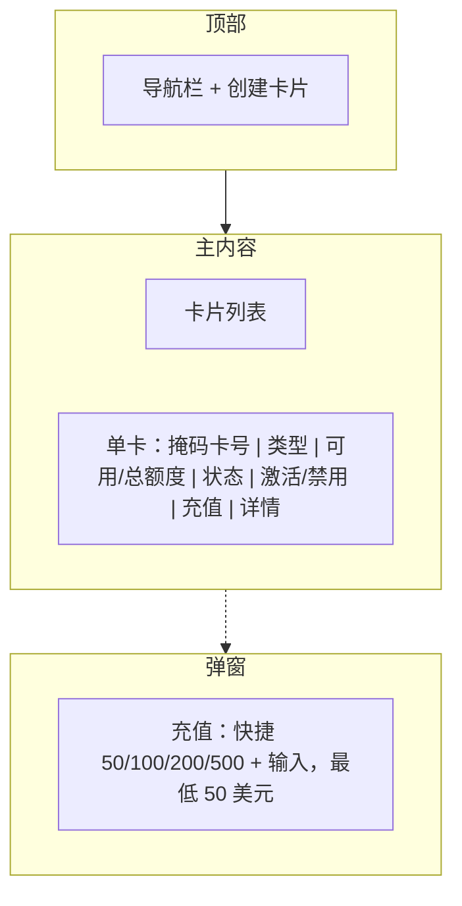

### 元素清单

| 区域 | 元素 | 说明（对应 PRD） |
|------|------|------------------|
| 顶部 | 导航栏 | 标题「我的卡片」 |
| 顶部 | 创建卡片 | 跳转 cards/create |
| 列表项 | 卡片号 | 掩码显示 |
| 列表项 | 卡片类型 | cardType |
| 列表项 | 可用额度/总额度 | availableAmount / limitAmount |
| 列表项 | 卡片状态 | 0 正常 / 1 禁用 |
| 列表项 | 激活/禁用 | 切换状态 |
| 列表项 | 充值 | 打开充值弹窗，快捷 50/100/200/500，最低 50 美元 |
| 列表项 | 查看详情 | 跳转 cards/detail |

---

## 7. 卡片详情

- **路由**：`pages/cards/detail`
- **文件**：`src/pages/cards/detail.vue`

### 布局说明

顶部导航带返回；主体为卡片信息区（卡号掩码、类型、额度、有效期等）、操作区（查看完整卡号需二级密码）、交易记录列表；查看完整卡号弹窗需输入二级密码后展示完整卡号、CVV。

### 结构图

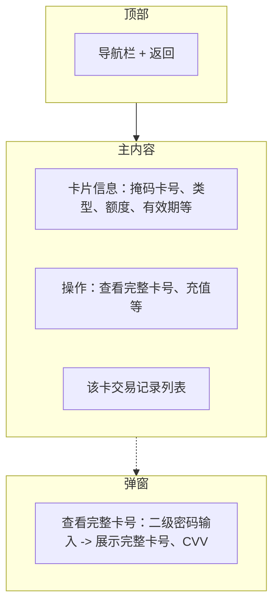

### 元素清单

| 区域 | 元素 | 说明（对应 PRD） |
|------|------|------------------|
| 顶部 | 导航栏 | 标题「卡片详情」，返回列表 |
| 信息区 | 卡号 | 安全掩码显示 |
| 信息区 | 卡片类型、额度、有效期等 | 来自 getByCardToken |
| 操作 | 查看完整卡号 | 需二级密码验证，调用 selectCardDetail |
| 操作 | 充值 | 同列表页充值逻辑 |
| 交易记录 | 列表 | 该卡交易记录，分页 |

---

## 8. 创建卡片

- **路由**：`pages/cards/create`
- **文件**：`src/pages/cards/create.vue`

### 布局说明

顶部导航带返回；主体为长表单：卡段选择（来自 cardPermissions，isApply 控制可选/置灰）、持卡人信息（姓名、地址、city/state/zipCode、email、phone、birthDate）、卡片额度、有效期等；底部提交按钮。

### 结构图

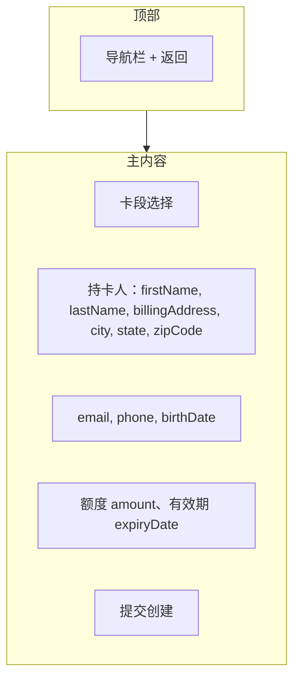

### 元素清单

| 区域 | 元素 | 说明（对应 PRD） |
|------|------|------------------|
| 顶部 | 导航栏 | 标题「创建卡片」，返回列表 |
| 表单 | 卡段 | cardBin，来自 cardPermissions，isApply 控制可选 |
| 表单 | 姓名 | firstName, lastName |
| 表单 | 账单地址 | billingAddress, city, state, zipCode |
| 表单 | 联系 | email, phone, birthDate |
| 表单 | 额度与有效期 | amount, expiryDate |
| 表单 | 提交 | 调用 create，cardType 固定 Virtual Card |

---

## 9. 交易记录列表

- **路由**：`pages/bills/list`
- **文件**：`src/pages/bills/list.vue`

### 布局说明

顶部导航；筛选区（交易类型：收入/支出、交易状态、时间范围）；主内容为交易记录列表（类型、金额、时间、状态、商户等）；支持分页、下拉刷新。

### 结构图

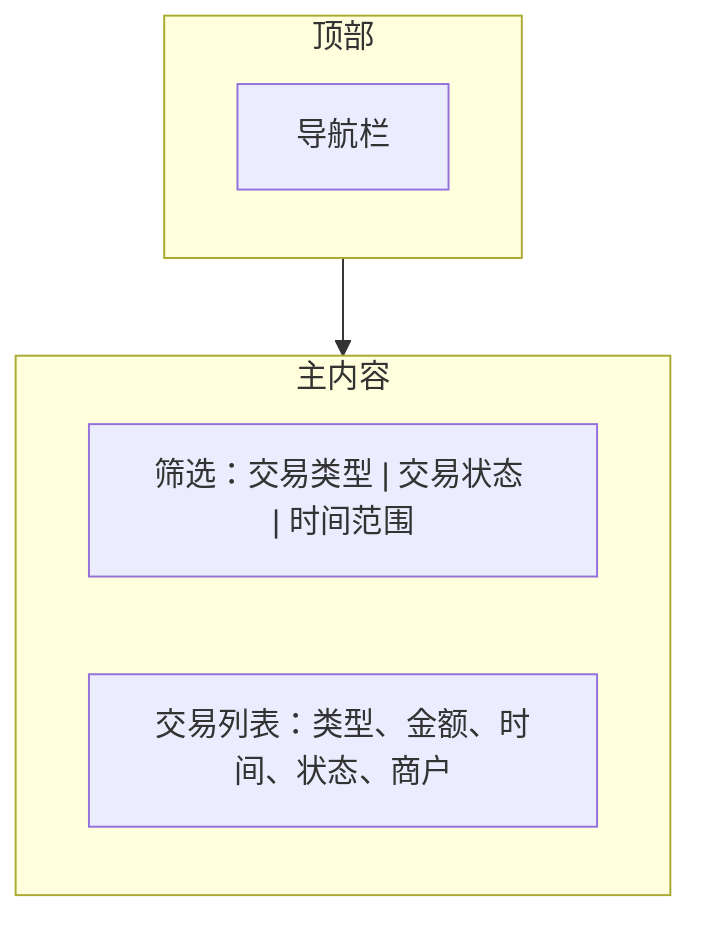

### 元素清单

| 区域 | 元素 | 说明（对应 PRD） |
|------|------|------------------|
| 顶部 | 导航栏 | 标题「交易记录」 |
| 筛选 | 交易类型 | 收入 / 支出 |
| 筛选 | 交易状态 | 成功/失败/处理中等 |
| 筛选 | 时间范围 | 可选 |
| 列表项 | 交易类型/名称 | transactionTypeName |
| 列表项 | 金额 | transactionAmount |
| 列表项 | 时间 | createTime |
| 列表项 | 状态 | transactionStatusName |
| 列表项 | 商户 | merchantName |
| 列表项 | 点击 | 跳转 bills/detail |

---

## 10. 账单详情

- **路由**：`pages/bills/detail`
- **文件**：`src/pages/bills/detail.vue`

### 布局说明

顶部导航带返回；主体为单笔交易详细信息展示（只读），字段以接口 detail/{id} 返回为准。

### 结构图

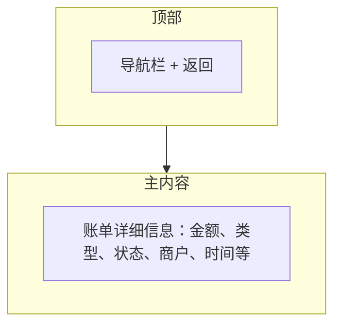

### 元素清单

| 区域 | 元素 | 说明（对应 PRD） |
|------|------|------------------|
| 顶部 | 导航栏 | 标题「账单详情」，返回交易列表 |
| 内容 | 账单详情 | 展示 sys_business_bill/detail/{id} 返回的全部字段 |

---

## 11. 资金流水

- **路由**：`pages/funds/list`
- **文件**：`src/pages/funds/list.vue`

### 布局说明

顶部导航；主内容为资金流水列表，每项展示交易类型（收入/支出）、金额、可用余额、状态、描述、时间；支持分页、下拉刷新。

### 结构图

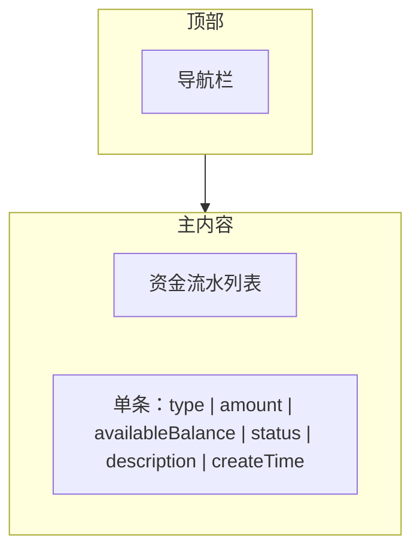

### 元素清单

| 区域 | 元素 | 说明（对应 PRD） |
|------|------|------------------|
| 顶部 | 导航栏 | 标题「资金流水」 |
| 列表项 | 类型 | Credit / Debit |
| 列表项 | 金额 | amount |
| 列表项 | 可用余额 | availableBalance |
| 列表项 | 状态 | Completed / Pending / Failed |
| 列表项 | 描述 | description |
| 列表项 | 时间 | createTime |

---

## 索引（一页一图）

| 序号 | 页面 | 路由 | 结构图所在节 |
|------|------|------|--------------|
| 1 | 登录 | pages/auth/login | §1 |
| 2 | 首页 | pages/home/index | §2 |
| 3 | 个人中心 | pages/profile/index | §3 |
| 4 | 修改密码 | pages/profile/password | §4 |
| 5 | 设置二级密码 | pages/profile/second-password | §5 |
| 6 | 卡片列表 | pages/cards/list | §6 |
| 7 | 卡片详情 | pages/cards/detail | §7 |
| 8 | 创建卡片 | pages/cards/create | §8 |
| 9 | 交易记录列表 | pages/bills/list | §9 |
| 10 | 账单详情 | pages/bills/detail | §10 |
| 11 | 资金流水 | pages/funds/list | §11 |

*HTML 线框设计图见 [docs/design/](design/)（每页一 HTML，浏览器可直接打开）。*
